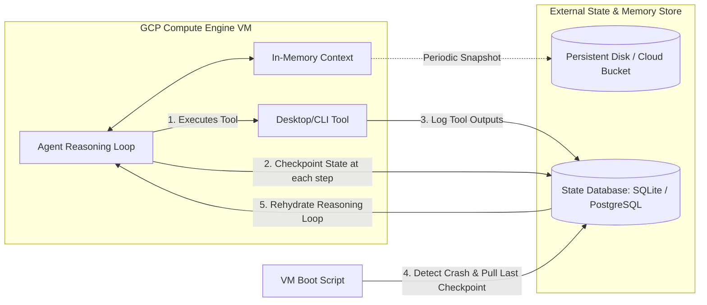

# 🦾 Fault-Tolerant Agent Architecture: Hardening Unit 27B on GCP

This architectural brief elaborates on Martin Kleppmann's thesis regarding **software-level fault tolerance** and applies it directly to the deployment of the autonomous agent **Unit 27B** on Google Cloud Platform (GCP) Compute Engine.

---

## 🚨 The Cloud Reality: Ephemeral vs. Reliable

In traditional computing, you bought expensive, highly reliable hardware (redundant power supplies, ECC RAM, RAID disks) to keep your system up. In the modern cloud (AWS, GCP):
1. **Instances are commodity and ephemeral:** GCP prioritizes flexibility. VMs are migrated dynamically, pre-emptible (Spot) instances can be terminated with a 30-second warning, and hardware hypervisors are updated live.
2. **Failure is a guarantee, not an anomaly:** A cloud instance *will* disappear, reboot, or lose network access.
3. **Implication for Unit 27B:** If Unit 27B's reasoning loop relies on the in-memory state of a single running Python process on a GCP VM, **Unit 27B is highly fragile.** If GCP reboots the VM for host maintenance, the agent's active reasoning state, tool execution progress, and immediate context are lost forever.

---

## 🛠️ The Software Fault-Tolerance Blueprint for Unit 27B

To tolerate the loss of the entire GCP virtual machine without losing the agent's progress, we must design Unit 27B's architecture to be **fault-tolerant at the software level**. 

Here is how we translate Kleppmann's principles into Unit 27B's systems design:

### 1. State Externalization (Decoupling Compute from State)
- **Concept:** Never store the agent's core memory, task goals, or execution history *solely* in Python's volatile RAM.
- **Application:** Use an external, persistent state database (like a local SQLite database mapped to a GCP persistent disk, or a remote PostgreSQL instance). Every time the agent completes a step in its reasoning loop (e.g., completes a tool execution or receives a prompt response), it must write a **Checkpoint** to this database.

### 2. Transactional Reasoning Steps
- **Concept:** Treat each step of the agent's loop as an atomic transaction.
- **Application:** If the VM is killed *mid-execution* of a command, the database state must reflect that the step was "IN_PROGRESS" but never finalized. Upon reboot, the agent reads its own state, realizes a crash occurred during a specific step, and runs a recovery routine (e.g., checking if the command actually ran or safe-retrying it).

### 3. Zero-Downtime Rolling Upgrades for Agents
- **Concept:** Kleppmann talks about patching systems "one node at a time" without downtime.
- **Application:** If you have a complex system where Unit 27B coordinates multiple sub-agents or tasks, you can perform rolling upgrades. You spin up a new version of the agent code on a second VM, point it to the persistent state database, gracefully shut down the old VM's agent loop (waiting for its current step to finish), and let the new agent pick up the next task seamlessly.
